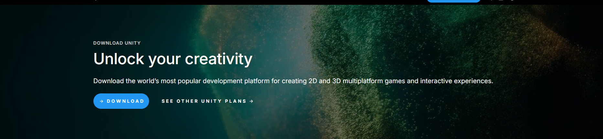
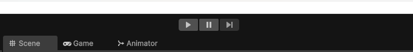

# Virtual-Insanity-Donuts-Project-V.I.D-
A VR game of "Bop-it" set in an parking structure / office horror setting.  
The project utilizes Khrono's Open XR for use on most all modern PC-VR devices,  
and Unity engine 2022.3.45f1 LTS

# Table of contents
- [What is Project V.I.D?](#what-is-project-vid)
  
- [Why Donuts?](#why-donuts)
  
- [Software Development LifeCycle : Agile-Scrum](#software-development-lifecycle--agile-scrum)
  
- [How to run](#how-to-run)
  
- [More Info : Who we are](#more-info)
-------------------

# What is Project V.I.D?  
<h2>- Virtual Insanity & Donuts</h2>

  Essentially, it is a VR-Horror game experience heavily focused on audio and player reaction. The initial idea for the game is that it would run like the toy "Bop-It" or "Simon Says", where the player is given a flashlight toggle function and is placed in the center of a dark room with 4 doorways in each cardinal direction. Within the span of 1 minute, audio cues would occur randomly at least twice emanating from each of the cardinal direction signaling what action the player must take to stay safe and move on to the next "room". For now, we planed on making these the simple ruleset or the "10 commandments" that the player must make in order to progress/win in the game. The player should be able to read these rules whenever they pause the game as well!
  
  Rule 1) Entity/Audio1 -> Flash the light down this hall within the next 30seconds or before the third play of this audio   (or leave into the next safe room before then).
    
  Rule 2) Entity/Audio2 -> Whatever you do, DON'T shine the light down this hallway.
    
  Rule 3) Entity/Audio3 -> Whatever you do, DON'T make a sound while in this room .
    [Note: this sound will never play if Audio4 occurs in this room too].
    
  Rule 4) Entity/Audio4 -> Assert dominance and make a sound within 30seconds or before the third play of this audio. (or leave into the next safe room before then)
    [Note: this sound will never play if Audio3 occurs in this room too].
    
  Rule 5)  Entity/Audio5 -> A safe hallway to get to the next room. Click on the black area in between the pillars to go through.
    
  Rule 6) Audio6 -> (Silence) another safe hallway to get to the next room. Click on the black area in between the pillars to go through.
    
  Rule 7) Clicking on the black area in between pillars that emitted sounds in rules 1-4 also causes the player to loose (Death).
    
  Special Rule 8) After 25 rounds, the player wins.
    
  Special Rule 9) When the player first spawns in, they are facing north with the starting elevator behind them so they have only 3 "rooms" to choose from at first.
    
  Special Rule 10)  Don't die.

# Why Donuts?
<h2>- The Game's Story</h2>

The "Donuts" come from a game story idea if there's enough time to implement it:

You're a tech intern at a company that sells "AR glasses with 3D audio." and as you go down the elevator, a voice message/s from your own company AR glasses plays :

"Your boss thanks you for taking some doughnuts to the construction workers in zone 25 working on the lighting system going haywire in the parking/office structure..."

But then you get a cryptic audio transcribed via your AR glasses giving you the ruleset (10 commandments) of the game.

When you exit the elevator, you realize that the place is strangely darker, somber, and bigger than before... 
Good thing your AR glasses have a built in flashlight... maybe it was warning you of something!

The game ends in a minor jump scare after round 25 when a construction worker takes off your AR glasses and yells at you for almost running into their ladder, revealing that the AR glasses were playing a horror game overlayed to the office building's parking space!

Otherwise, you succumb to the "Entities" in the game.

# Software Development LifeCycle : Agile-Scrum
<h2>- How we made the game:</h2>
Making a whole VR-Game can be daunting.
Thus, our group uses the Agile-framework and Scrum-methodology to ensure our project is made via tangible increments of iterations! Our project roadmap is tied to our sprint sheet here : <a href="https://sites.google.com/oakland.edu/thecatstoneproject/home/project-roadmap">Link to sprint roadmap.</a>
 
 Above is our project roadmap that we made to keep track of game development.
   
 
 Above is our project Scrum-Agile methodology to utilize sprints (2-week development sprints). 

# How to run
<h2>- How to run game & source code:</h2>
<h4>1) Install Unity.</h4>
(*Note: This was made in Unity version 2022.3.45f1 LTS, but any version above that should work as well. 
(*Moreover, you need to install Unity Hub to get the Unity Engine and open projects. Link can be found <a href="https://unity.com/download"</a> HERE 
If upgrading the project is needed, do so and it "shouldn't" glitch the code.*)
    
  
<h4>2) Download and Open the project by selecting the "Asset" Folder.</h4>
(*Some help can be found via Unity forums : Link can be found :
  <a href="https://discussions.unity.com/t/how-to-open-unity-project-from-project-folder-where-file-is/641138"> HERE*)</a>

    
  
<h4>3) Make sure your PC-VR device is connected.</h4>
  
  (*Note: We've tested on Meta and Windows MR devices. Steps for how to connect different devices to unity can be found online.*)
<h4>4) Wear your PC-VR device and hit "Play" in the unity engine.</h4>
  

# More Info
<h2>- The Catstone Project - Who we are:</h2>
We are 5 students from Michigan's Oakland University who aimed to make a Virtual-Reality, 3D-audio,   horror experience for their 4999-Capstone class.  

Our website for this project can be found here : <a href="https://sites.google.com/oakland.edu/thecatstoneproject/home
">Link to our project's website.</a>  
The Github repo this project can be found here : <a href="https://github.com/Drewayou/Virtual-Insanity-Donuts-Project-V.I.D-">Link to our project's Github Repository.</a>  
